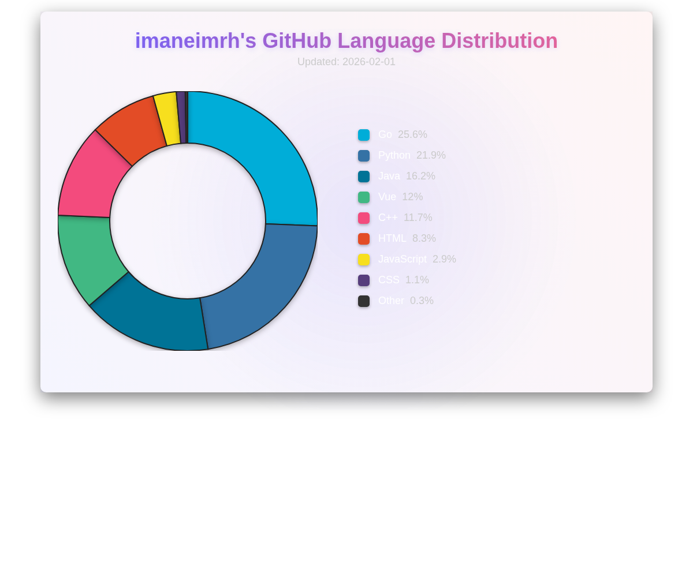

# Hello, I'm Imane ۶ৎ✮⋆˙
Welcome to my corner of GitHub! ⋆✴︎˚｡⋆ 

I'm a **Data Science graduate** from UM6P turned **Computer Science engineering student** at the College of Computing - UM6P. My journey started with an obsession for gaining insights about life through analyzing the information we collect. That's why I discovered my passion for data science, and along the way, I've been diving into new and exciting fields in computing, such as building software, optimizing algorithms, or crafting useful applications.  

## ─── ⋆⋅☆⋅⋆ ──When I code, I rely on─── ⋆⋅☆⋅⋆ ──

##  My GitHub Stats 
#### ꩜ GitHub Profile Summary

#### ꩜ My Top Languages 

  

## What I'm Up To  
Currently, I'm:  
- Exploring **AI-driven applications** and **distributed computing**  
- Expanding my knowledge of **system design and backend development**  
- Working on projects that **solve real-world problems**   

## Beyond The Code  
When I'm not immersed in code or analyzing data, you might find me **reading books** or **learning about psychology and niche subjects**.  

## ⋆˚࿔ Connect With Me

---
